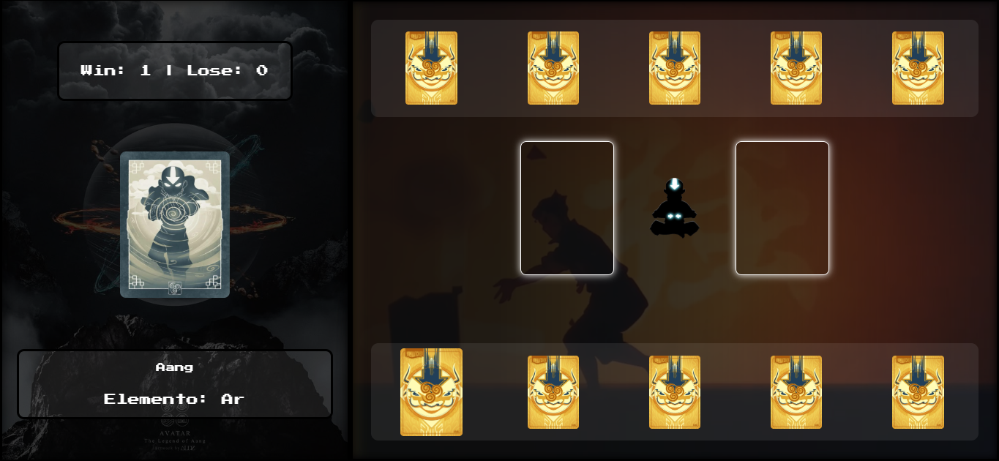

# Avatar – Batalha dos Elementos

Jogo de cartas inspirado em *Avatar: A Lenda de Aang*, desenvolvido com **HTML, CSS e JavaScript**.

---

## 🕹️ Como jogar

### Desktop
- Passe o mouse sobre a carta para ver detalhes (nome e tipo de elemento).  
- Clique na carta para jogá-la no campo de duelo.  
- Você também pode arrastar e soltar a carta no campo de duelo.

### Mobile / Touch
- Primeiro toque na carta → mostra detalhes.  
- Segundo toque → joga a carta no campo de duelo.

---

## ⚔️ Regras do jogo

Cada carta representa um elemento e possui condições de vitória e derrota:

| Carta | Tipo  | Vence | Perde |
|-------|-------|-------|-------|
| Aang  | Ar    | Terra | Fogo  |
| Katara| Água  | Fogo  | Terra |
| Zuko  | Fogo  | Ar    | Água  |
| Toph  | Terra | Água  | Ar    |

- **Sistema de pontuação:**  
  - Carta vencedora → jogador ganha 1 ponto  
  - Carta perdedora → computador ganha 1 ponto  
  - Empate → nenhum ponto
  - Vitória: 10 pontos

---

## 📱 Responsivo

- Detalhes da carta aparecem ao passar o mouse (desktop) ou toque único (mobile).  
- Jogar carta com clique (desktop) ou segundo toque (mobile).  
- Drag & drop de cartas no campo do duelo (desktop).  
- Áudio e efeitos visuais para imersão.  
- Responsivo: funciona em diferentes tamanhos de tela.  

---

Desenvolvido por: Henrique Baptista Bandeira 👨🏻‍💻
